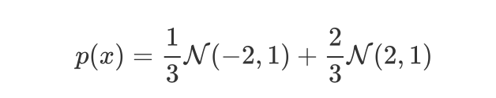
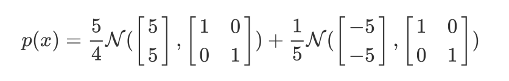

# gradient_MCMC
visualising gradient based MCMC methods

- [x] [Langevin dynamics](http://citeseerx.ist.psu.edu/viewdoc/download;jsessionid=321EE83B91BA3766CBB02BF6ABEB5751?doi=10.1.1.226.363&rep=rep1&type=pdf)
- [x] [Stein variantional gradient decent (SVGD)](https://arxiv.org/pdf/1608.04471.pdf)

### Run

```
python runexp.py
```

### 1D Gaussian Mixture



|  |  |
| :--------------------------------------: | :------------------------------------: |


### 2D Gaussian Mixture



|  |  |
| :--------------------------------------: | :------------------------------------: |

